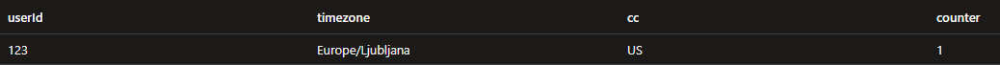
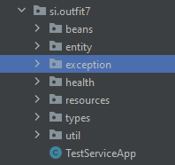
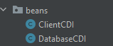
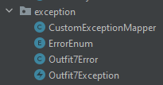
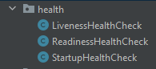
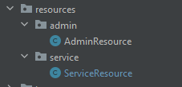
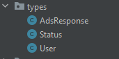
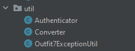

# Test-service
> This service is part of the Mobile game application "Fun7".
> It is used by users and administrators to check the state of the other services.

## Table of Contents
* [Technologies Used](#technologies-used)
* [Features](#features)
* [Availability](#availability)
* [Database](#database)
* [Docker-hub](#docker-hub)
* [Assumptions](#assumptions)
* [Source code description](#source-code-description)
* [Build and test service](#build-and-test-service)
* [Kubernetes](#kubernetes)
* [Contact](#contact)

## Technologies Used
- Java 11
- JakartaEE - version 9.1
- MicroProfile - version 5.0
- OpenLiberty - version 22.0.0.7-beta
- Docker
- Kubernetes
- JUnit 5
- Testcontainers

## Features
This service has two REST API interfaces with functions:
1. Service: Used by users to check the status of the three services.
   1. checkServices
2. Admin: Used by administrators for managing the users.
   1. getAllUsers, return all users in database.
   2. getUserDetails, return user's data for specified user.
   3. deleteUser, delete specified user from database.

## Availability
Service is deployed on public Cloud: http://20.23.64.180:8080

Open API 3.0 Swagger is available on link: http://20.23.64.180:8080/openapi/ui/

Service was made as docker image, and is ready to deploy on any public or private Kubernetes cluster.

## Database
Test-service doesn't have its own database, instead it uses public serverless database.
Database has only one table (TEST_USER) for storing user's data:
- userId: User identification (max. 8 characters)
- timezone: User timezone
- cc: Country code of the user (max. 2 characters)
- counter: Shows how many times the user called "Fun7" application.
### Example:

## Docker-hub
Service image is available on publicly accessible Docker hub repository: https://hub.docker.com/repository/docker/corkovic/test-service

## Assumptions
I made an assumption, every time the checkServices() function is called it is checked
whether the user with userId already exists in database.
If it doesn't exist then function create new user and inserts data (userId, timezone, cc)
into the user table (TEST_USER) and set counter on user to 1.
If it exists, function will find user, update his data depending on input parameters, and 
increment counter for 1.

Every time when we call function checkServices() with the same userId the counter will
be incremented by one, so multiplayer feature for specified user will be enabled only if the 
user comes from US and function checkServices() is called more than 5 times for specified user.

## Source code description
Source code is divided into several packages:

- beans: Contains CDI beans for connecting to the database and accessing the client REST service.

  

- entity: Contains Jakarta JPA entity for mapping database table (USER_TABLE).

  

- exception: Contains classes for customizing error handling and sending specific 
responses back when an exception or error occurs. Custom error class Outfit7Error
contains data about error code, HTTP status code and error description.
Classes in this package should be isolated in one common library.
Every "in house" service should import that library. In that case we have standardized error
responses for all our services.

  

- health: Contains health check probes, useb by Kubernetes.

  

- resources: Contains implementation of two REST APIs. 

  

- types: Contains classes that represent REST API responses.
  Classes in this package should be part of global "data model" library.
  In that case we avoid that each service defines own data type model 
  (example, every service has own types for Account, Error, User data, ...).
  Instead of that service should use common types from global "data model" library.

  

- util: Contains util classes for converting java database entities to java types and vice versa.
Outfit7ExceptionUtil prepare, log and throw application errors.
Authenticator class prepare HTTP header with Basic authentication, used for calling client REST service.

  

- liberty/config/server.xml:
Contains settings for Openliberty server.

- resources/META-INF/persistent.xml:
Definitions of DataSource connection to serverless database.

- Dockerfile: Instructions for building Docker image.

Service decouple database entity model (used for communication with database) 
from java data type model (used as response of REST API).
In case we made some changes to our database model REST interface remains the same.
## Build and test service
### Running a Build

1. Clone the repository to your system.

        git clone https://github.com/ggant/test-service.git

2. Run a Maven build.

         mvn clean package
3. Build docker image

         docker build -t test-service .    
4. Tag the image and prepare to push on image repository (Docker hub, etc.)

         docker tag test-service:latest <repositoy>/test-service:1.0
5. Push image on repository

         docker push <repositoy>/test-service:1.0  

### Test service
The service uses JUnit and Testcontainer frameworks for running integration tests. To successfully run test user machine must have Docker installed. 
1. Run integration tests.

         mvn verify

## Kubernetes
The service can be installed on any private or public Kubernetes cluster.
The only requirement is that cluster has access to the Internet and permits outgoing connections on port 1433 (serverless SQL database).

Inside the source code are two .yaml files that are used to set up test-service on Kubernetes cluster:
- [deployment.yaml](deployment.yaml) -> Create namespace, configMap, Secret and Deployment. 
Image will be pulled from default Docker hub repository: corkovic/test-service:1.0. 
You should change that if you build and push image on other repository.

        kubectl apply -f deployment.yaml
- [service.yaml](service.yaml) -> Create service endpoint.

      kubectl apply -f service.yaml

## Contact
Created by [Goran Ćorković](mailto:corkovic@gmail.com)
